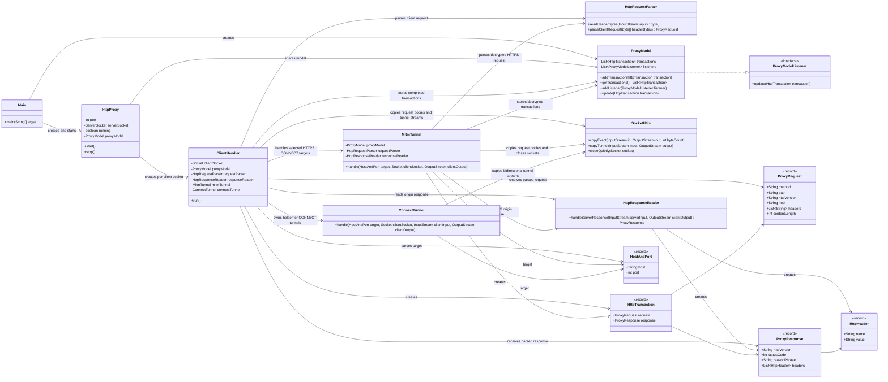
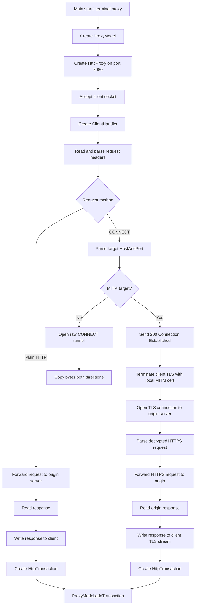

``` mermaid
classDiagram
    direction LR

    class Main {
        +main(String[] args)
    }

    class HttpProxy {
        -int port
        -ServerSocket serverSocket
        -boolean running
        -ProxyModel proxyModel
        +start()
        +stop()
    }

    class ClientHandler {
        -Socket clientSocket
        -ProxyModel proxyModel
        -HttpRequestParser requestParser
        -HttpResponseReader responseReader
        -MitmTunnel mitmTunnel
        -ConnectTunnel connectTunnel
        +run()
    }

    class HttpRequestParser {
        +readHeaderBytes(InputStream input) byte[]
        +parseClientRequest(byte[] headerBytes) ProxyRequest
    }

    class HttpResponseReader {
        +handleServerResponse(InputStream serverInput, OutputStream clientOutput) ProxyResponse
    }

    class MitmTunnel {
        -ProxyModel proxyModel
        -HttpRequestParser requestParser
        -HttpResponseReader responseReader
        +handle(HostAndPort target, Socket clientSocket, OutputStream clientOutput)
    }

    class ConnectTunnel {
        +handle(HostAndPort target, Socket clientSocket, InputStream clientInput, OutputStream clientOutput)
    }

    class SocketUtils {
        +copyExact(InputStream in, OutputStream out, int byteCount)
        +copyTunnel(InputStream input, OutputStream output)
        +closeQuietly(Socket socket)
    }

    class ProxyModel {
        -List~HttpTransaction~ transactions
        -List~ProxyModelListener~ listeners
        +addTransaction(HttpTransaction transaction)
        +getTransactions() List~HttpTransaction~
        +addListener(ProxyModelListener listener)
        +update(HttpTransaction transaction)
    }

    class ProxyModelListener {
        <<interface>>
        +update(HttpTransaction transaction)
    }

    class ProxyRequest {
        <<record>>
        +String method
        +String path
        +String httpVersion
        +String host
        +List~String~ headers
        +int contentLength
    }

    class ProxyResponse {
        <<record>>
        +String httpVersion
        +int statusCode
        +String reasonPhrase
        +List~HttpHeader~ headers
    }

    class HttpHeader {
        <<record>>
        +String name
        +String value
    }

    class HttpTransaction {
        <<record>>
        +ProxyRequest request
        +ProxyResponse response
    }

    class HostAndPort {
        <<record>>
        +String host
        +int port
    }

    Main --> ProxyModel : creates
    Main --> HttpProxy : creates and starts

    HttpProxy --> ProxyModel : shares model
    HttpProxy --> ClientHandler : creates per client socket

    ClientHandler --> HttpRequestParser : parses client request
    ClientHandler --> HttpResponseReader : reads origin response
    ClientHandler --> MitmTunnel : handles selected HTTPS CONNECT targets
    ClientHandler --> ConnectTunnel : owns helper for CONNECT tunnels
    ClientHandler --> ProxyModel : stores completed transactions
    ClientHandler --> HostAndPort : parses target
    ClientHandler --> ProxyRequest : receives parsed request
    ClientHandler --> ProxyResponse : receives parsed response
    ClientHandler --> HttpTransaction : creates
    ClientHandler --> SocketUtils : copies request bodies and tunnel streams

    MitmTunnel --> HttpRequestParser : parses decrypted HTTPS request
    MitmTunnel --> HttpResponseReader : reads HTTPS origin response
    MitmTunnel --> ProxyModel : stores decrypted transactions
    MitmTunnel --> HttpTransaction : creates
    MitmTunnel --> SocketUtils : copies request bodies and closes sockets
    MitmTunnel --> HostAndPort : target

    ConnectTunnel --> SocketUtils : copies bidirectional tunnel streams
    ConnectTunnel --> HostAndPort : target

    HttpResponseReader --> ProxyResponse : creates
    HttpResponseReader --> HttpHeader : creates
    HttpTransaction --> ProxyRequest
    HttpTransaction --> ProxyResponse
    ProxyResponse --> HttpHeader
    ProxyModel ..|> ProxyModelListener
```

```mermaid
flowchart TD
    A[Main starts terminal proxy] --> B[Create ProxyModel]
    B --> C[Create HttpProxy on port 8080]
    C --> D[Accept client socket]
    D --> E[Create ClientHandler]
    E --> F[Read and parse request headers]

    F --> G{Request method}
    G -->|Plain HTTP| H[Forward request to origin server]
    H --> I[Read response]
    I --> J[Write response to client]
    J --> K[Create HttpTransaction]
    K --> L[ProxyModel.addTransaction]

    G -->|CONNECT| M[Parse target HostAndPort]
    M --> N{MITM target?}
    N -->|No| O[Open raw CONNECT tunnel]
    O --> P[Copy bytes both directions]

    N -->|Yes| Q[Send 200 Connection Established]
    Q --> R[Terminate client TLS with local MITM cert]
    R --> S[Open TLS connection to origin server]
    S --> T[Parse decrypted HTTPS request]
    T --> U[Forward HTTPS request to origin]
    U --> V[Read origin response]
    V --> W[Write response to client TLS stream]
    W --> X[Create HttpTransaction]
    X --> L
```